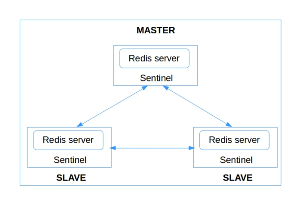

# Redis Cluster with Sentinel

- Install Redis from source

- Setup Redis cluster with sentinel

## Requirements

- Open redis ports to any limited IPs

- Install & run Redis on CentOS7/Ubuntu-16.04+

